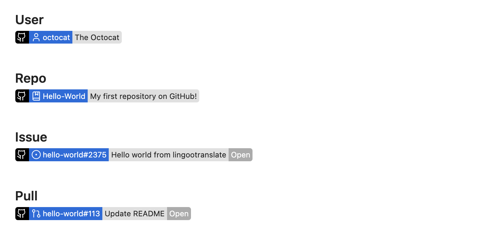

# Obsidian GitHub Issues

Display information about GitHub users, repos, issues, and PRs in Obsidian notes.

## Configuration

No additional configuration is needed to work with users and public repositories. To
display information for non-public repositories at [GitHub PAT](https://docs.github.com/en/authentication/keeping-your-account-and-data-secure/managing-your-personal-access-tokens)
will need to be configured in the plugin settings.

Because fine-grained access tokens only grant access to a single user or organization,
if access to repositories from multiple scopes is needed, a classic access token should
be used.

## Details

### Inline embeds

Text starting with the desired prefix (default `GH:`) will be displayed in reading
or live preview mode with details of the referenced GitHub object.

Supported references are:

- User: `GH:octocat`
- Repo: `GH:octocat/Spoon-Knife`
- Issue or PR: `GH:octocat/Spoon-Knife#9`

## Todo

There are some additional features I'd like to add:

- [ ] Compact display mode
- [ ] Fenced code blocks
  - [ ] Issue list
  - [ ] User card
  - [ ] Repo card
  - [ ] Issue/PR card
  - [ ] Search
- [ ] Multiple access tokens

## Acknowledgements

Inspired by the [Jira Issue plugin](https://obsidian.md/plugins?id=obsidian-jira-issue)
